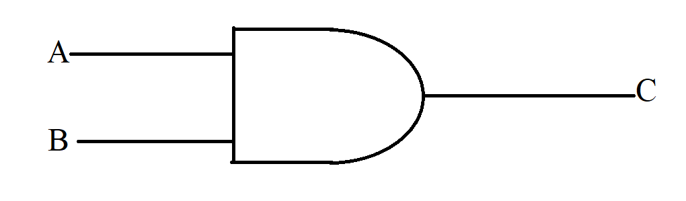

\newpage

# Understanding Computation

## Boolean Logic

Named after George Bool: Boolean Logic, often called Boolean Algebra, is a branch of algebra where the variables deal with individual truth values. These are combined with various logical operations that are similar to the way we combine arguments in normal languages.

1. Negation $(\neg)$
   * Negation essentially flips the truth value of a single variable
     $$
        \begin{bmatrix}
            A&\big|&\neg A\\
            \hline
            T&\big|&F\\
            F&\big|&T\\
        \end{bmatrix}
     $$
2. Logical Conjuction $(\land)$
   * This is also called a logical AND. This operation take two truth values and combines them returning true if both variables are true and false otherwise.
   * It works like the *and* in english.
     $$
        \begin{bmatrix}
            A&B&\big|&A\land B\\
            \hline
            T&T&\big|&T\\
            T&F&\big|&F\\
            F&T&\big|&F\\
            F&F&\big|&F\\
        \end{bmatrix}
     $$
3. Logical Disjunction $(\lor)$
   * This is also called a logical OR, it's truth value is true if either one of the combining variables are true.
   * This has the same intuition of *or* in english.
     $$
        \begin{bmatrix}
            A&B&\big|&A\lor B\\
            \hline
            T&T&\big|&T\\
            T&F&\big|&T\\
            F&T&\big|&T\\
            F&F&\big|&F\\
        \end{bmatrix}
     $$

We can also combine these basic operations to form more complex sentences:
$$
\neg(\neg B\land A)\land \neg(C\lor\neg D)
$$
Some secondary operations we can construct include:

1. Exclusive Or $(\oplus)$
   * This is a special version of OR that returns false if both values are true.
     * It's construction is as follows:
       $$
        x\oplus y = (x\lor y)\land\neg(x\land y)
       $$
     $$
        \begin{bmatrix}
            A&B&\big|&A\oplus B\\
            \hline
            T&T&\big|&F\\
            T&F&\big|&T\\
            F&T&\big|&T\\
            F&F&\big|&F\\
        \end{bmatrix}
     $$
2. Material Implication $(\rightarrow)$
   * The material implication is essentiall an **if then** scenario. $A\rightarrow B$ roughly would translate to *if* $A$, *then* $B$.
     * It's construction is as follows:
       $$
        x\oplus y = \neg x\lor y
       $$
     $$
        \begin{bmatrix}
            A&B&\big|&A\rightarrow B\\
            \hline
            T&T&\big|&T\\
            T&F&\big|&F\\
            F&T&\big|&T\\
            F&F&\big|&T\\
        \end{bmatrix}
     $$
3. Equivalence $(\equiv)$
   * Equivalence means that two variables have the same truth value. This means that it returns true if they are both false or if they are both true.
     * It's construction is as follows:
       $$
        x\equiv y = (x\land y)\lor\neg(x\lor y)
       $$
     $$
        \begin{bmatrix}
            A&B&\big|&A\equiv B\\
            \hline
            T&T&\big|&T\\
            T&F&\big|&F\\
            F&T&\big|&F\\
            F&F&\big|&T\\
        \end{bmatrix}
     $$
Notice that $(A\equiv B) = \neg(A\oplus B)$

Since our variables can only be true or false, it often becomes easy to look at values as either bieng a 1 (for true) or 0 (for false). Using this construction we can actually use the exclusive or (XOR) as an addition operator to get us from one to the other:
$$
\begin{aligned}
    1\oplus1 &= 0\\
    1\oplus0 &= 1\\
    0\oplus1 &= 1\\
    0\oplus0 &= 0\\
\end{aligned}
$$
And or logical conjunction becomes a multiplication operation:
$$
\begin{aligned}
    1\land1 &= 1\\
    1\land0 &= 0\\
    0\land1 &= 0\\
    0\land0 &= 0\\
\end{aligned}
$$
This allows us to form a ring and express some argumetns as linear equations over the boolean domain $\mathbb{B}$:
$$
(a\land x)\oplus(b\land y)\oplus(c\land z)
$$

## Binary

If we think about how we represent our numbers we can realize that we can split any particular number into a sum of powers of 10:
$$
    1032 = 1\cdot10^3 + 0\cdot10^2 + 3\cdot10^1 + 2\cdot10^0
$$
This is what we call base 10 since we can write our number in terms of 10. Notice that our coefficients range from 0-9.

Likewise binary is a number system with a base of 2. Like how our decimal system has 10 symbols, and goes from 0-10, binary has 2 symbols and stretches from 0-1. We can write our normal numbers in binary form by doing the same decomposition, this time in terms of 2:
$$
\begin{aligned}
    15 = 1\cdot2^3 + 1\cdot2^2 &+ \cdot2^1 + 1\cdot2^0\\
    15_{10} &= 1111_2
\end{aligned}
$$
Since binary numbers are written with ones and zeros, they are perfect for representing boolean logic.

This can allow us to represent expressions as simply performing logical operations on binary numbers. Since electronic hardware can create binary signals of either 0 (off) or 1 (on), then those signals can then interact with a logic gate which represents one of the various operations.



This is how we encode logic into our programs by being able to encode an expression into binary signals and performing operations over them.

Each signal is called a bit of information.

### Hexadecimal

There are a few other useful bases that we might want to use. One is called hexadecimal or base 16. It uses the symbols: 0,1,2,3,4,5,,6,7,8,9,A,B,C,D,E,F
$$
\begin{aligned}
    15_{10} &= \text{F}_{16}\\
    16_{10} &= 10_{16}\\
    1032_{10} &= 408_{16}\\
    365_{10} &= 16\text{D}_{16}
\end{aligned}
$$
Since a single hexadecimal number has less characters than a binary number we can use it to represent binary numbers more compactly:
$$
15_{10} = 1111_2 = \text{F}_{16}
$$
The the 4 bits required to form a single hex character is called a byte.

To see this in action, we can take a large binary number:
$$
1101010101101101
$$
And separate it into bytes:
$$
(1101)\quad(0101)\quad(0110)\quad(1101)
$$
And then convert each byte into hexadecimal
$$
\text{D}56\text{D}
$$

## Algorithm

An algorithm is a finite sequence of instructions that have a clear beginning and end, and usually result in some computation. One thing to keep note of is that the instructions are unambigious and it should be clear what to do at each step. Algorithms can loop around through different steps however.

When programming this is mainly what we are doing, we are writing an algorithm that a computer will interpret as binary instructions and run.

One of the oldest algorithms in the world is Euclid's Division Algorithm for finding the greatest common factor.

## Models for Computation

This raises the question about forming a more rigorous definition for computation. In the years following WWII two theories will develop, one by Alan Turing, the other by Elonzo Church.

### Turing

Alan Turing is credited with the most popular model for computation. This is called a **Turing Machine**.

A turing machine is a machine that lives on an infinitely long tape, this machine moves between sections of that tape and can read what's on that tape and perform comparisons, and it can also write to that section of the tape. Everything it does is given by a set of rules. These rules come from our algorithm and Turing showed that every algorithm could be rewritten in terms of rules that a Turing machine could follow.

This is the model that most computers are built on. However in the real world there are no infinitely long tapes, despite this we can still form sufficiently large tapes. We call this tape memory and each section of memory holds a binary number, the computer can then perform logical operations on those numbers according to a set of rules.

### Church

Another model for computation was created by Elonzo Church. Church was Turin's doctoral advisor and worked alongside him. His model is called the **Lambda Calculus**. and it operates primarily by expressing computation as a series of function compositions.

This is a rather complicated topic so I won't go into much detail, but essentially we have variables and functions. Implementations of the functions themselves aren't specified, we only know that they take in a particular input $x$ and return a particular output $y$. We then proceed to *bind* a variable to a function
$$
(\lambda x.y)
$$
This function takes in an $x$ and returns a $y$. Rather than having functions take in more than one variable at a time we separate each input as it's own function and have the output of that function be another function which takes in another variable:
$$
(\lambda x.(\lambda y.z))
$$
This would be equivalent to the mathematical expresion $f(x,y)=z$.

We can also apply a function over a variable:
$$
(x~y)
$$
Which is equivalent to $x(y)$ in the standard mathematical notation you might be used to.

This can produce rather complicated expressions like so:
$$
(\lambda z.w~((\lambda x(\lambda y.z)~x)~y))
$$

We can also perform reduction operations, namely $\alpha$-conversion and $\beta$-reduction, but I won't get into those.

Both Turing and Church's models are equivalent forms of computation.

This theory of computation is more relevant for mathematical analysis and in some programming languages like Haskell.

### Halting Problem

One of the problems people found while coming up with these models was that sometimes our programs can enter infinite loops. So it may be useful to be able to tell whether or not a program will loop forever or come to a stop.

This is called the halting problem and Alan Turing proved that this is undecidable. That is that it is impossible to tell in the general case whether a program will loop or halt given it's input.

## Modern Computers

Armed with a some knowledge about the history of computation and that we can describe arbitrary instructions as binary operations, we are now ready to tackle how your program will interact with the computer itself.

Again these topics can get pretty deep, so I will only be covering the necessary basics that one **must know**.

In a computer we represent binary through different signal voltages. A HIGH voltage is interpreted as 1, while a LOW voltage is 0.

### Memory

**Computer Memory** is a very interesting subject, but essentially it boils down to finding a way to save a specific set of signals for a certain amount of time, and then passing them off when needed. The instructions that can be executed to retreive or write to a particular place in memory is called a **memory address**. This is usually in the form of a hexadecimal number and might look something like: `0x19DA8B266FFE`

The specific implementations for memory storage aren't important here and extend way beyond programming itself. So I will be talking mainly about the way we interact with memory.

Your computer has two types of memory, Random Access Memory, and Disk Storage. Random Access Memory is usually where most programs live. When your program sends instructions, those instructions are sent to certain spots in memory and it can be accessed in any random order. RAM essentially acts as the tape for our turing machine.

Disk Storage is for more permanent storage and it's where all your files, passwords, and important information lives. There are ways to access this memory however. If you know the particular memory addresses there is pretty much nothing stopping your from reading or writing to it.

***side note:***\
Sometimes you'll see the word contigious being thrown around when talking about memory. This basically means that something is stored over multiple memory addresses each of them right next to each other.

### Operating Systems

The **Operating System** is essentially the master program that is constantly active, checking various parts of your computer's memory. Anytime you want to access something in your computer your operating system will allow you to do so. It may also deny you the ability to access certain parts of your computer's memory.

If your program tries to access a piece of memory it is not allowed to, your Operating System can shut your program down causing it to abruptly end. When this happens it is called a **segmentation fault**.

Your programs can also interact with the OS and requests various things, like creating a window or asking to access a graphics card to draw a triangle on a screen. You can also ask the OS to give you access to read and write specific files.

### Networks

Computer networks work by sending data down from one machine to another. This data is simply binary signals (quick pulses of HIGH or LOW voltage). The transmitter will encode a sequence of instructions into a sequence of HIGH and LOW voltage signals. It will then send those signals through a wire were they will interact with the receiving computer which will read and interpret those signals. LOW voltage signals are interpreted as 0, while HIGH voltage signals are interpreted as 1.

There are various protocols and different techniques and approaches to network architecture to ensure this process is safe so don't assume this is everything, but that's basically how it works.

## Running Programs

Now on to a bit more detail about how your programs actually run on your computer. As a programmer this is something you want to know because it can help you troubleshoot some issues.

It's also important to know what your program is doing inside the machine.

### Program Stack

When your program is running, your operating system will allocate a certain finite strip of memory. This is called your program's **Call Stack**.

This is called a stack because the different actions your program is doing are stacked in order of which ones are currently active. These actions are called subroutines, and as a new subroutine is added it goes at the top of the stack, once it is finished it is removed and the subroutine beneath it will continue to run until it finishes or creates a new subroutine.

Everything that is added on to the stack also has to have a predetermined size as well.

If you happen to add too many things on to the stack, your program will start looking for memory outside of it's designated area. This is called a **Stack Overflow**, named after the terrible web forum.

When a stack overflow occurs the operating system will cause a seg fault.

### Heap Access

The fact that our stack has limited memory, and that anything put on the stack requires a predetermined size, creates a problem. What if we wanted to use something in our program, but didn't know how much memory it would take?

This is what the **HEAP** is for.

The heap is meant for dynamic memory allocation, and it is essentially """*infinite*""" memory. You can still use up the heap, however the heap has so much free memory that this is unlikely unless your computer is really short on resources.

How it works is your program will notify the OS that you want to allocate memory for something but you don't know how much big it will be. Your operating system will then go through and reserve a memory address for your program depending on the size of what you want to store. It will then reserve additional spots for your object to grow.

If your object happens to get too big the OS will simply find a new memory address with enough neighbours to fill your object plus a few more size increases.

When your program no longer needs that memory, it is a good idea to go and clear the memory from the heap. Not being mindful of your memory management and forgetting to clear data can lead to a **memory leak**.

# Programming Languages

Now we can start breaking into the actual bread and butter of programming, and that's languages.

If you remember, I mentioned when programming we essentially encode the logical steps in our algorithm as binary numbers. This is obviously not very fun to do by hand and for more complicated expressions it isn't very practical. For this reason we *need* ways to abstract our logic in a way that's easy for us to understand, but also something that a computer can interpret as binary.

## Machine Code

The first attempt at something like this was called **machine code**. This is essentially what your computer turns into binary, however it is slightly less annoying than binary in the sense that you can kind of understand some of the structure underneath.

This is obviously not any more helpful though and there's a reason we've moved beyong writing code like this.

## Assembly

**Assembly** is not any particular language in itself, instead the term assembly represents any language that has a near 1-1 correspondence between the instructions you write down and the machine code they produce.

Unlike machine code, assembly uses actual english to refer to specific instructions. It uses shorthand such as `MOV` for *move to address* or *move from address*.

Assembly has move, load, read, and write instructions, as well as a few other arithmetic and comparison instructions that allow us to express any particular algorithm (Modern assembly also has a lot of instructions for performing more complex mathematical tasks). If we return back to our idea of a turing machine and the specific rule set it follows, Assembly practically **is** the rules that our turing machine follows.

However this doesn't make it any nicer to follow along.

For example, this assembly code will...

```x86asm

```

## C and Modern Languages

It is around this point where more and more abstractions happened, people began writing **compilers**, which are essentially programs that will read text and generate assembly code. With a compiler, you could write something in a more human readable language, and turn that into assembly, and run that assembly.

Many languages came around during this time with the most popular being a little language called C.

C is much more structured than Assembly and a lot of the syntax used in most languages actually derives from it.

Back then people wrote books on how to use a language. For C this book was called *The C Programming Language* and is also where the popular `Hello World` starter program came from:

```C
printf("Hello World");
```

As languages became more and more abstract from the original machine code, we were allowed to make shortcuts in our programming. This allows for languages like python and javascript where the code looks a lot more like readable human language.

```py
print(sum(range(10)))
```

An example python program that prints all the numbers from 0 to 10. Don't worry if you don't understand it yet, just look at how easy it is to read and interpret.

## Compilation vs. Interpretation

As languages became more abstract, developers began to forego the use compilers and began to use what are called **interpreters**.

In compilation, you write down your program and then you run it through a compiler. This compiler will turn your program into assembly, and then you can execute the created binary whenever you want.

The way a compiler does this is by turning the text into what's called an Abstract Syntax Tree. It essentially breaks down your program into various pieces, each piece represents a unique part of your program. This allows the compiler to map out how your program uses memory, how many calculations you're making, and also the general structure of your program. It can then choose to optimize it and rearrange those pieces. The compiler will then take all those pieces and recreate your program step by step into assembly code.

An interpreter is basically a program that will read your code line by line and execute instructions on the fly without checking to see if it works yet. This can sometimes be both a blessing and a curse as compilation times can take a long time, but if your program compiles it is unlikely to crash when running. Meanwhile an interpreter may crash at any time during your program's execution if there is a mistake or a problem, but it allows you to write and test code a lot faster.

An interpreter will also try breaking down your program, but instead of breaking them into smaller parts and rearranging them, it will simply try interpreting each piece as an instruction, turning that directly into machine code and executing it.

## Introduction to Programming

So now that we know where programming languages come from, and what they sort of do, it's time to actually see how they work and how we use them.

We will begin by briefly doing a quick hello world program

### Hello World

Here are a few basic `Hello World!` programs in multiple languages. Hopefully this shows the different ways in which the languages can achieve the same thing, showcasing what makes them unique and also showing how similar they can be at the same time.

C
```C
#include <stdio.h>

int main() {
  printf("Hello World!");
  return 0;
}
```

Java
```Java
public class HelloWorld {
  public static void main(String[] args) {
    System.out.println("Hello World!");
  }
}
```

Rust
```rust
fn main() {
  print!("Hello World!");
}
```

Haskell
```haskell
main :: IO()

main = putStrLn "Hello World!"
```

Python
```py
print("Hello World!")
```

JavaScript
```js
console.log("Hello World!");
```

Assembly:
```x86asm


```

### Language Structure

Every language has these things called IDENTIFIERS


Okay now we want to start seeing how we write code. We will begin with the primitive data types that we can assign to memory.

In the next Chapter I will talk about the types that we can define our data to be.

If you do happen to have a programming language you are already learning or trying to use, feel free to follow along with me. You will most likely learn how to use that language much faster and retain more as you go.